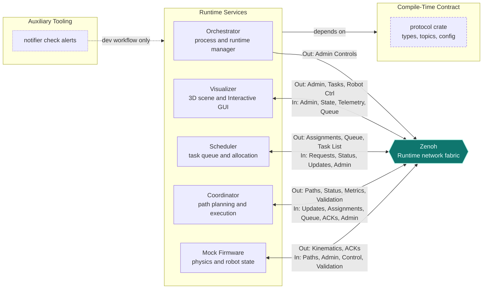
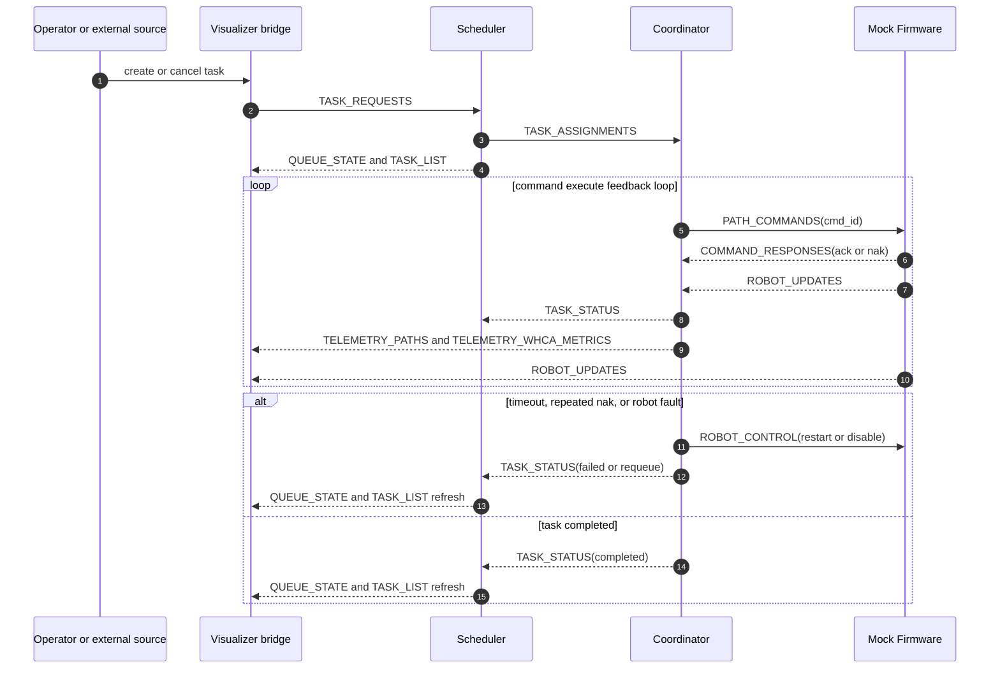
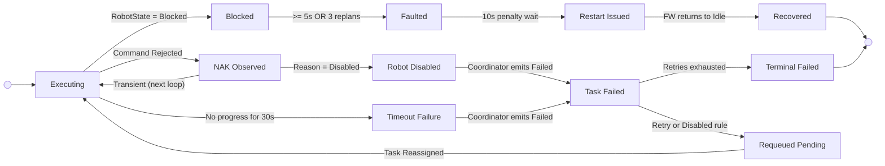

# Tessera: High-Performance Digital Twin

A distributed warehouse orchestrator for multi-agent logistics. Built for systems-level experimentation using Rust, Tokio, Zenoh, and Bevy.

[](https://www.rust-lang.org/)
[](https://tokio.rs/)
[](https://bevyengine.org/)
[](https://zenoh.io/)
[%20%7C%20A*-%230b7285)](https://github.com/omarg-dev/hyper-twin-rs)
[](https://github.com/omarg-dev/hyper-twin-rs/stargazers)
[](https://github.com/omarg-dev/hyper-twin-rs/commits)


## Why This Project Matters

Tessera is a distributed systems architecture disguised as a 3D digital twin. Standard simulations tightly couple rendering and routing into a single monolithic execution loop. But real-world logistics (Cyber-Physical Systems) operate over asynchronous networks where latency, dropped packets, and desync are the baseline. Tessera is built to model that reality.

By isolating the control plane, pathfinding, physics, and visualization into decoupled microservices over a Zenoh pub/sub network fabric, the architecture mirrors a production environment. It is designed so that any layer can be effortlessly replaced by another (e.g., swapping the "mock firmware" layer with physical hardware robots) while the rest of the system continues to operate with no core changes. This makes it an ideal testbed for studying multi-agent coordination, distributed systems behavior, and the real-world impacts of network latency on logistics operations.

Core Engineering Outcomes:

- Scale & Limits: Designed to evaluate WHCA* space-time conflict resolution under heavy network load. Current benchmarks expose clear congestion trade-offs, and very-high-agent-count stability remains an active optimization target.
- Failure Isolation: State and execution are strictly decoupled. A crash in the `visualizer` or a timeout in the task `scheduler` will not affect the core physics engine or the pathfinding logic.
- Observability: Every command, path request, and telemetry update is a distinct network packet, making the entire system transparent to network-level debugging and chaos testing.

## Full Demo Showcase

coming soon...

## Table of Contents

- [Tessera: High-Performance Digital Twin](#tessera-high-performance-digital-twin)
  - [Why This Project Matters](#why-this-project-matters)
  - [Full Demo Showcase](#full-demo-showcase)
  - [Table of Contents](#table-of-contents)
  - [System Snapshot](#system-snapshot)
  - [Tessera's Graphical User Interface (GUI)](#tessera-graphical-user-interface-gui)
  - [Usage](#usage)
    - [Quick Start](#quick-start)
    - [Operational Commands](#operational-commands)
  - [Architecture](#architecture)
  - [System Logic](#system-logic)
    - [Network Topics and Protocol Contracts](#network-topics-and-protocol-contracts)
    - [Timing and Concurrency](#timing-and-concurrency)
    - [Pathfinding Strategy](#pathfinding-strategy)
    - [Fault Tolerance](#fault-tolerance)
  - [Challenges & Discussions](#challenges--discussions)
      - [Engineering Trade-offs](#engineering-trade-offs)
        - [Rust over C#/Python](#rust-over-cpython)
        - [Bevy over Unity/Unreal](#bevy-over-unityunreal)
        - [Zenoh over MQTT](#zenoh-over-mqtt)
        - [WHCA over Conflict-Based Search (CBS)](#whca-over-conflict-based-search-cbs)
        - [Microservices over a Monolith](#microservices-over-a-monolith)
        - [Strict Protocol Library over Ad-Hoc Messages](#strict-protocol-library-over-ad-hoc-messages)
        - [Bidirectional UI over a Pure Observer](#bidirectional-ui-over-a-pure-observer)
      - [The 1000 robots problem O(R^2)](#the-1000-robots-problem-or2)
      - [Hardware-in-the-Loop (HIL) Substitution](#hardware-in-the-loop-hil-substitution)
  - [Repository Map](#repository-map)
  - [License & Acknowledgements](#license--acknowledgements)

## System Snapshot

| Architecture Layer | Technology Stack | Primary Purpose |
| :--- | :--- | :--- |
| **Core Engineering** | Rust, Tokio | Memory-safe async execution & process management. |
| **Network Fabric** | Zenoh | Zero-overhead, decoupled pub/sub telemetry. |
| **Protocol Contracts** | Custom Rust types | Clear topic schemas and message structures. |
| **Coordination Logic** | WHCA* | Multi-agent space-time conflict resolution. |
| **Visualization Engine** | Bevy ECS | High-performance, data-driven 3D visualization. |
| **Runtime Control** | Orchestrator CLI | Centralized process lifecycle and chaos controls. |

## Tessera's Graphical User Interface (GUI)

Tessera provides a live interface for interacting with the underlying system, alongside a 3D view that contains a functional replica of the warehouse. The visualization layer runs completely independently from the core simulation. This ensures that UI interactions and rendering will never slow down the physical robots or the routing logic.

*Note: This section is a visual showcase of the operator controls. Technical implementation details are covered in the Architecture and System Logic sections below.*

| Feature | Demonstration |
| :--- | :--- |
| **Live Task Injection & Execution**<br>Operators can manually assign tasks directly from the interface. Once a request is made, the system automatically validates it, finds an available robot, and handles the entire pick-up and drop-off process. |  |
| **Dynamic Tracking & Navigation**<br>Clicking on any robot or task locks the camera to it. This allows operators to easily monitor individual agents as they navigate complex routes and actively avoid collisions in real time. |  |
| **Real-Time Telemetry & Analytics**<br>The inspector panel provides a live look under the hood. It gathers data from across the system to expose a robot's exact speed, planned route, and pathfinding health, and other metrics without adding unnecessary load to the network. | |
| **Fault Monitoring & Recovery**<br>If traffic gets too heavy and two robots collide, the system catches it. Instead of freezing the warehouse, the UI flags the error, and the system automatically halts the affected agents, marks the tasks as failed, and safely restarts the affected robots back to their designated stations. | |


## Usage

### Quick Start

Build workspace:

  ```bash
  cargo build --workspace
  ```

Launch the orchestrator crate:

  ```bash
  cargo run -p orchestrator
  ```

In the orchestrator CLI, bring all services up:

  ```bash
  > run
  ```

alternatively, you can run with a specific layout:

  ```bash
  > run -l 2
  ```


### Operational Commands

Orchestrator command surface:

```text
╭─────────────────────────────────────────────────╮
│  PROCESS MANAGEMENT                             │
├─────────────────────────────────────────────────┤
│  run, up        - Run all crates                │
│  run <crate>    - Run specific crate            │
│  run (default)  - release mode                  │
│  run -d|-dev    - dev mode (debug binaries)     │
│  run -l <id>    - Run all with selected layout  │
│  run <crate> --layout <id> - Run crate layout   │
│  kill, down     - Kill all crates               │
│  kill <crate>   - Kill specific crate           │
│  restart        - Kill + run all                │
│  status, ps     - Show process status           │
│  layout, l      - List available layouts        │
├─────────────────────────────────────────────────┤
│  OUTPUT VISIBILITY (takes effect on next spawn) │
├─────────────────────────────────────────────────┤
│  show <crate>   - Open crate CLI in a window    │
│  hide <crate>   - Run crate silently            │
│  show all       - Window all crates             │
│  hide all       - Silence all crates (default)  │
├─────────────────────────────────────────────────┤
│  RUNTIME COMMANDS                               │
├─────────────────────────────────────────────────┤
│  pause, p       - Pause simulation              │
│  resume, r      - Resume simulation             │
│  verbose on/off - Toggle verbose output         │
│  chaos on/off   - Toggle chaos engineering      │
├─────────────────────────────────────────────────┤
│  quit, q        - Kill all and exit             │
│  help, h        - Show this help                │
╰─────────────────────────────────────────────────╯
```

## Architecture

Tessera enforces strict process isolation. State and control flow are entirely decoupled and topic-driven via the Zenoh network fabric. This ensures that a failure in the`visualizer` or `scheduler` does not halt the physical simulation for example.

- Orchestrator: Manages process lifecycle and broadcasts system-level runtime controls (pause, kill, chaos).
- Mock Firmware: The physical state authority. Simulates robot state progression, hardware constraints, and command ACKs.
- Coordinator: The routing authority. Owns the WHCA* routing algorithm and monitors telemetry for deadlocks.
- Scheduler: The allocation authority. Ingests tasks and queues them for the `coordinator` based on agent availability.
- Visualizer: A decoupled telemetry consumer and operator bridge. Renders the Bevy 3D environment, and acts as a visual gateway for other layers, allowing for human-in-the-loop task injection and admin control.

Process boundaries are explicit and topic-driven:



Task lifecycle sequence (behavior over time)




## System Logic

### Network Topics and Protocol Contracts

| Topic | Constant | Publisher(s) | Subscriber(s) | Purpose |
| --- | --- | --- | --- | --- |
| warehouse/robots | ROBOT_UPDATES |`mock_firmware` | `coordinator`, `scheduler`, `visualizer` | robot updates/telemetry |
| warehouse/commands | PATH_COMMANDS | `coordinator` |`mock_firmware` | path commands |
| warehouse/commands/responses | COMMAND_RESPONSES |`mock_firmware` | `coordinator` | ACK/NAK and command feedback |
| warehouse/admin/control | ADMIN_CONTROL | `orchestrator`, `visualizer` | `coordinator`, `scheduler`, `mock_firmware`, `visualizer` | pause/resume/verbose/chaos/time scale |
| warehouse/admin/robots | ROBOT_CONTROL | `coordinator`, `visualizer` |`mock_firmware` | robot up/down/restart |
| warehouse/admin/map_hash | MAP_VALIDATION | `coordinator` |`mock_firmware` | startup map consistency check |
| warehouse/tasks/requests | TASK_REQUESTS |`visualizer`/external | `scheduler` | new/cancel/update task requests |
| warehouse/tasks/assignments | TASK_ASSIGNMENTS | `scheduler` | `coordinator` | task dispatch |
| warehouse/tasks/status | TASK_STATUS | `coordinator` | `scheduler` | task lifecycle state |
| warehouse/tasks/queue | QUEUE_STATE | `scheduler` | `coordinator`, `visualizer` | queue monitoring |
| warehouse/tasks/list | TASK_LIST | `scheduler` |`visualizer` | full task list for UI |
| warehouse/telemetry/paths | TELEMETRY_PATHS | `coordinator` |`visualizer` | route line telemetry |
| warehouse/telemetry/whca_metrics | TELEMETRY_WHCA_METRICS | `coordinator` |`visualizer` | WHCA runtime metrics |

### Timing and Concurrency

Tessera bridges an asynchronous transport layer (Zenoh) with strict, fixed-rate physical control loops.

- Asynchronous Transport: Zenoh pub/sub delivery is purely event-driven. The `coordinator` continuously polls incoming telemetry and commands without blocking. The `visualizer` runs background subscribers on a Tokio runtime, feeding payloads into bounded channels that Bevy drains per frame.
- Fixed-Step Execution: The physical firmware operates at a strict 50ms (20Hz) tick rate. The `coordinator` loop sleeps for 10ms but dispatches paths at the 50ms cadence. Path telemetry is heartbeated every 1000ms if unchanged, or instantly upon a path signature shift.
- Concurrency Boundaries: Task ingestion relies on non-blocking network polling to prevent fan-in from stalling peers. WHCA* planning is deterministic and executes in the main control flow, while Bevy's isolated frame-driven rendering ensures `coordinator` load never tanks the UI framerate.

### Pathfinding Strategy

The `coordinator` runs Windowed Hierarchical Cooperative A* (WHCA*) using strict space-time reservations.

- Reservation Grid: Space-time reservations map a 3D key (x, y, time) to a specific robot_id. Each robot maintains a secondary index of its reservations, allowing O(k) cleanup upon task completion or failure.
- The Horizon: The pathfinder plans 32 steps ahead (a 16-second rolling window at 500ms intervals). Wait actions inside blocked corridors are capped at ~5 seconds to prevent indefinite deadlocks.
- The Stationary Tax: Idle or faulted robots reserve a 2.5-second footprint and lock their previous 4 spatial cells so trailing agents don't rear-end them.
- Strict Failure: If WHCA* hits the edge of the 16-second window without finding a route, it hard-fails (None). I intentionally avoided dynamic fallbacks to standard A* to force the system to handle true congestion failures.
- Spatial Precision: Collision detection applies a ±200ms tolerance around target times. Path reservations are calculated using measured physical velocity, falling back to a default speed of 2.0 if the agent is stationary at assignment.

Reservation Grid Example (Center time bins shown; each bin expands by ±200ms during collision checks):

| Time (ms) | Cell (10,4) | Cell (11,4) | Cell (12,4) | Cell (11,5), stationary robot 2 |
| ---       | ---         | ---         | ---         | ---                             |
| 0         | R7          | .           | .           | R2                              |
| 500       | R7          | R7          | .           | R2                              |
| 1000      | .           | R7          | R7          | R2                              |
| 1500      | .           | .           | R7          | R2                              |
| 2000      | .           | .           | R7 (dwell)  | R2                              |
| 2500      | .           | .           | .           | R2                              |


### Fault Tolerance

Tessera enforces a hard boundary between the physical state authority and the control plane. If the hardware fails, the routing layer needs to isolate it.

- Execution vs. Control: Firmware owns motion execution, hardware constraints, and command rejection. The `coordinator` owns the state machine, timeout escalation, and status reporting.
- Timeout & Retry Guards:
  - No-Progress: Tasks failing to progress for 30 seconds trigger an automatic timeout.
  - Blocked Escalation: Agents blocked for over 5 seconds or failing 3 consecutive replan attempts escalate to a Faulted state.
  - Delivery Confirmation: Drop-off attempts retry every 3 seconds (up to 3 times) before rolling back.
- Robot recovery: Faulted agents get a 10-second penalty box. The `coordinator` then broadcasts a Restart command, resetting the firmware hardware state, clearing local queues, and forcing a recovery to Idle. This simulates a human operator power-cycling a stuck robot on the warehouse floor.
- Scheduler Requeue Policy: * If a task fails because a robot was disabled, the task is requeued as Pending.
  - If the planner throws a "no path to pickup" error, the `scheduler` executes a bounded retry with backoff penalties (max 3 attempts).
  - All other failures result in a terminal Failed state.
- Chaos Mode: this mode allows intentionally dropping telemetry and rejecting commands via the Orchestrator CLI to test these exact recovery paths under load.




## Challenges & Discussions

This section goes over the key engineering challenges faced during the design and implementation of the system, and the rationale behind the major architectural decisions.

### Engineering Trade-offs

By design, a system cannot have every feature an engineer wants. When building systems, difficult choices are around every corner. Here is what I prioritized in Tessera and what I sacrificed:

#### Rust over C#/Python

> Rock-solid execution and memory safety FOR a brutal learning curve and slower prototyping.

A discrete event system requires strict memory safety and robust async handling to avoid race conditions. I decided to go with Rust for its execution guarantees, paying the price of fighting the borrow checker, a brutal learning curve, and a much (much) slower initial prototyping phase compared to Python. The long-term payoff, however, is a rock-solid architecture that can handle the complexity of a distributed multi-agent system without falling apart under its own weight.

#### Bevy over Unity/Unreal

> Seamless backend Rust integration FOR building custom UI and debugging tools from scratch.

Bevy’s ECS naturally supports data-driven design, and its Rust foundation meant seamless integration with the rest of the backend workspace. This, of course, came along with its own set of problems. Dealing with a beta engine (v0.17) meant having to build custom UI panels and debugging tools from scratch instead of relying on a mature engine editor.

#### Zenoh over MQTT

> Hardware-ready, decentralized pub/sub FOR the mature ecosystem and tooling of MQTT.

I went with Zenoh for brokerless, peer-to-peer pub/sub in the local loop. Because Zenoh completely decouples publishers and subscribers, the system is hardware-ready: I can eventually swap the mock firmware for a physical ROS2 bridge node without touching the `coordinator`'s core logic. Or even better, I can merge the firmware and `coordinator` to be built into the robots themselves, completely decentralizing the system. The cost was giving up the massive, mature ecosystem and out-of-the-box debugging tools of MQTT.

#### WHCA* over Conflict-Based Search (CBS)

> Deterministic execution and bounded failure FOR absolute path optimality.

CBS generates more globally optimal routes, but it is incredibly complex to maintain under strict 50ms real-time constraints. I chose WHCA* because its 16-second rolling window bounds the execution time and provides a highly predictable failure mode (it simply stops routing when congested). I traded absolute path optimality for deterministic execution. Though I may implement CBS in the future as an alternative pathfinding strategy (which is simple architecturally thanks to the modular design), I wanted to first build a solid baseline with WHCA* to ensure the system can handle the core coordination challenges before adding a more dynamic algorithm.

#### Microservices over a Monolith

> Complete fault isolation FOR permanent serialization and network latency overhead.

Decoupling the system was one of the first goals I set up for this project; a random UI crash should never take down the physical simulation or halt the routing. Although this fault isolation is basically mandatory, it added permanent overhead. I have to pay the serialization and network latency tax on every tick instead of just passing memory pointers around a single application.

#### Strict Protocol Library over Ad-Hoc Messages

> A single source of truth FOR massive friction during early development.

I locked every network topic, configuration constant, and message schema into a single `protocol` crate. This created massive friction during early development because I had to update the central contract for every minor change, but it entirely eliminates "message drift" across the microservices with its single-source-of-truth nature. Need to change a topic name? Simple, just update the constant in the `protocol` crate and recompile. That's it.

#### Bidirectional UI over a Pure Observer

> Practical operability FOR the strict architectural purity of a read-only dashboard.

I added a command bridge to the `visualizer` for manual task injection and simulation controls. While this breaks my initial goal of a strict "read-only" visualization layer, I decided to trade the purity of a telemetry dashboard to allow the system to actually be operable and testable for a human without having to juggle multiple CLI interface for each process as if you are operating the matrix itself.


<!-- // TODO: document/fix dropoff ring of death

 -->

### The 1000 robots problem O(R^2)

This section documents an unresolved scaling limit and the engineering attempts made to push past it. Running 1000 concurrent agents currently degrades system stability, not because of a mathematical hard limit, but due to a cascading mixture of bottlenecks under extreme contention.

What I Tried (The Optimizations):
- Spatial Bucketing: Initially I used a naive all-pairs collision checking, this of course caused a 500k comparisons per second explosion. So I implemented spatial-bucket pruning to mitigate O(R^2) computation scaling in the `coordinator`.
- Network Throttling: Reduced control-plane fanout pressure by implementing change-driven path telemetry (with a heartbeat fallback) and throttling stationary reservation refreshes.
- Bounded Allocation: Limited the `scheduler`'s allocation and task-list windows to prevent the scheduler from flooding the network, causing system instability.

The Failure Cascade:
Currently, I've discovered that scaled degradation follows a predictable pattern:
- Contention Latency: As the number of robots increase, reservation density increases, WHCA* search times naturally rise.
- Stop/Replan Churn: The rising latency causes late command dispatches. Robots reach the end of their path, halt, and trigger a wave of new replan requests. This creates an infinite loop of contention and replanning.
- Backpressure: The resulting flood of panic-requests and task-status streams accumulates massive backpressure across the Zenoh bus.
- Throughput Collapse: Queueing overhead eventually dominates useful execution time. The `coordinator` fails to keep up with the real-time demands of the simulation, leading to a complete network stall, which then causes the system to desync and collapse under its own weight.


Future Paths:
My final destination for this project is to reach a 10,000-robot deployment. To hit that without tearing down the network or frying the hardware, the system will likely require moving to decentralized conflict handling on the firmware level, implementing hierarchical planning, or introducing a hybrid planner that relaxes strict WHCA* rules when traffic becomes uncontrollable.

### Hardware-in-the-Loop (HIL) Substitution

Tessera is designed to transition from a simulated environment to a physical Cyber-Physical System (CPS) without altering the coordination, scheduling, or the visualization logic. Because the `protocol` crate defines strict network schemas and Zenoh entirely decouples publishers from subscribers, the `mock_firmware` layer can be hot-swapped. Integrating physical robots requires a new hardware translation layer (e.g., a ROS2-to-Zenoh bridge) that consumes `PATH_COMMANDS` and publishes physical `ROBOT_UPDATES`. The rest of the system stack remains completely unaware of the physical substitution.

## Repository Map

Recommended reading order:

1. `crates/protocol` (contracts, topics, config)
2. `crates/coordinator` (routing and execution)
3. `crates/mock_firmware` (simulation and command responses)
4. `crates/scheduler` (queueing and allocation)
5. `crates/visualizer` (telemetry rendering and operator controls)
6. `crates/orchestrator` (process and runtime control)

## License & Acknowledgements
- [Rust](https://www.rust-lang.org/) for the memory safety and async capabilities that make this architecture possible.
- [Tokio](https://tokio.rs/) for the async runtime that allows for efficient concurrency and process management in Rust.
- [Zenoh](https://zenoh.io/) for the powerful pub/sub network fabric that makes this architecture possible.
- [Bevy](https://bevyengine.org/) for the flexible and high-performance game engine that enables real-time 3D visualization and operator interaction.

Licensed under the AGPL-3.0 License. See [LICENSE](LICENSE) for details.
